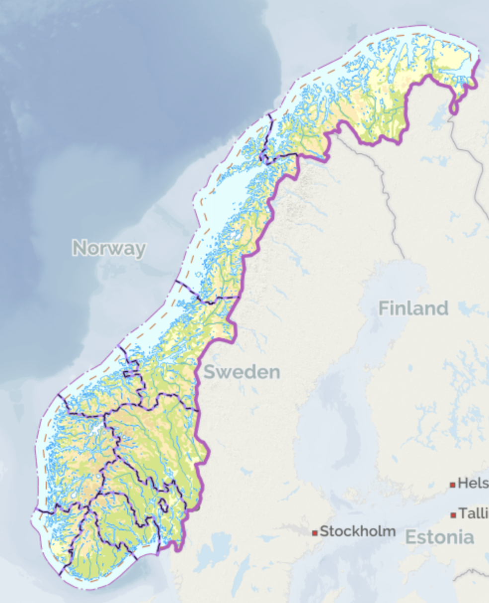

+++
title = "Hva er en fastlandsøy?"
[menu]
main = { weight = 9, parent = "Ideer" }
+++

<!-- markdownlint-disable MD033 -->

{}

Mange blir forvirret når jeg bruker begrepet "fastlandsøy" for å beskrive Norges øyer som ikke
er en del av øygruppa Svalbard, Jan Mayen, Bouvetøya, Peter 1.s øy og Dronning Mauds Land.

{}

I følge Wikipedia og Store Norske Leksikon, kalles dette egentlig for "hovedlandet". Men visste du
hva "hovedlandet Norge" henviser til?

For meg er det naturlig å vise til Norges fastlandsøyer som de øyer som ligger i tilknytning
til fastlandet.

Når jeg først har oppmerksomheten din, vil jeg gjerne fortelle deg om Norges største fastlandsøy,
som også er øya jeg har vokst opp med:

- Hinnøya huser Harstad by og kommune, samt kommunene Andøy, Hadsel, Lødingen, Sortland og Vågan
i Nordland fylke, samt Harstad, Kvæfjord og Tjeldsund i Troms fylke.

- Det går en ferge fra Hinnøya til Hinnøya mellom Revsnes og Flesnes, et godt alternativ for å
kjøre mellom Harstad og Sortland i stedet for å kjøre rundt på samme øy.

- Sortland by ligger derimot ikke på Hinnøya, men på Norges tredje største øy: Langøya.
Hinnøya "grenser" også til 10. største øy Andøya, 21. største Tjeldøya, 35.
største med Andørja, 41. største med Grytøya, 42. største med Rolla.

*Bildet er et utklipp av Kartverkets Norgeskart, som viser Norges fastland og fastlandsøyer.
© [Kartverket (kartverket.no) ](https://kartverket.no).*

<!-- Her er noen andre øyfakta:

- Nordland, Troms og Finnmark har topp 7 største fastlandsøyene i Norge, og til sammen
har fylkene 56 av 100 største øyer på fastlands-Norge.

- Bortsett fra Hinnøya, deler følgende
kystøyer en fylkesgrense: Austra (Nordland og Trøndelag).

- Men følgende øyer deler landegrener:
	- 
	
-->
