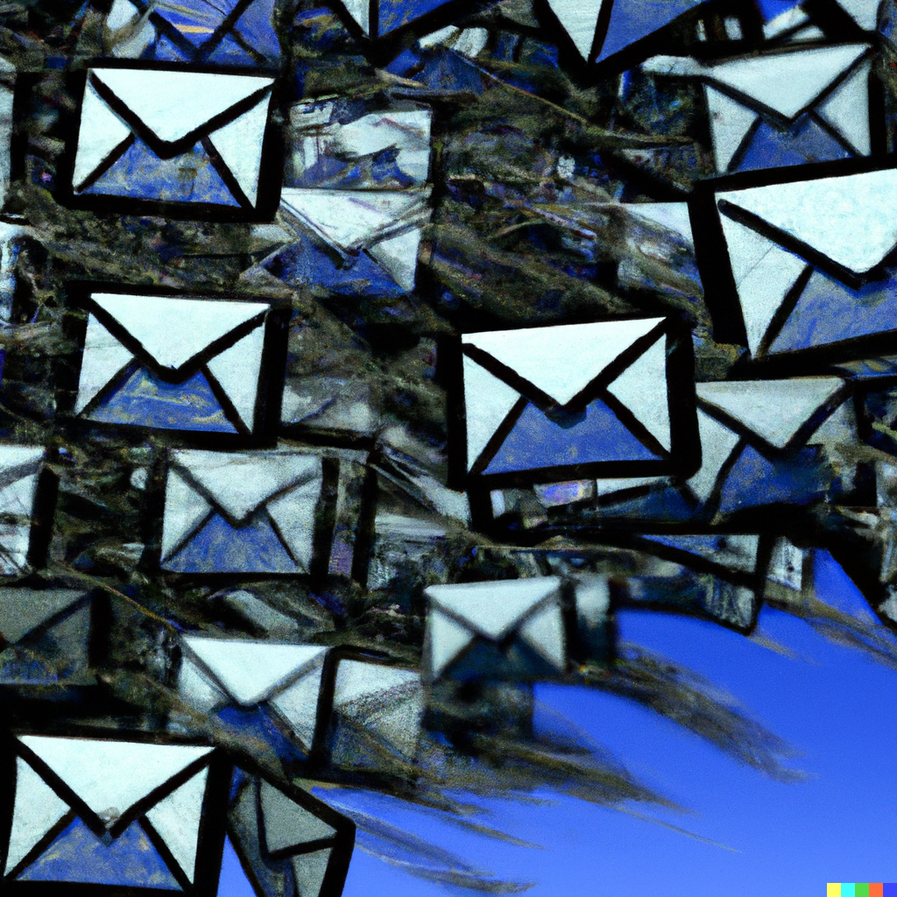

+++
title = "Phishing / falske e-poster"
lastmod = 2020-10-06T22:00:00
[menu]
main = { weight = 1, parent = "Personvern og sikkerhet" }
+++

 
{}

Av og til mottar vi falske e-poster som har til hensikt å enten lure til seg informasjon, svindle
mottakeren for en betaling eller skade datamaskinen. Dette kalles phishing. I denne artikkelen kan
du lære om hvordan du kan identifisere en slik e-post.

{}

#### Hva er phishing / falske e-poster?

Kriminelle sender ofte ut falske e-poster med den hensikt at mottakeren skal la seg lure til å tro
at e-posten er fra en legitim organisasjon, bedrift, tjeneste eller annen person. Informajonen i
e-posten er utformet slik at mottakeren skal reagere på en eller annen måte. Målet er at mottakeren
gir fra seg personlig informasjon, brukernavn og passord, kort- og kontoinformasjon, BankID/MinID
eller annen, verdifull informasjon.

E-postene, og nettsidene den fører til, kan se og virke legitime ut. Profesjonelle kopierer
designelementer fra de faktiske e-postene og nettsidene de prøver å etterlikne. Et trent øye ser
forskjell.

Normalt tenker vi på e-poster som sendes ut til tilfeldige mottakere, men kriminelle kan også sende
målretta e-poster til personer de vil at skal lure. Dette kan for eksempel være aktuelt for å få
tilgang til interne systemer i en bedrift eller organisasjon.

#### Dette kjennetegner phishing / falske e-poster

Det er flere *indikatorer* du kan se etter i slike e-poster. Ingen indikator alene kan fortelle om
noe er falsk eller ikke, man bør vurdere alle aspektene med e-posten.



{}

Sjekk e-postadressen den er sendt fra. For eksempel bør en e-post fra Bedriften AS komme fra
"post@bedriften.no", og ikke "newsletteryohoho@uninmailer.co.yk". Hvis e-posten er sendt fra en
e-postadresse som ikke gir mening, er den som regel ofte falsk.

Obs: Hvis e-postadressen ser ekte ut, betyr det ikke at den er legitim. Det *er* mulig å forfalske
e-postadresser, men som regel tar ikke de kriminelle seg tid til dette.

{}

{}

Det er ikke alltid dårlig språk, men mine erfaringer tilsier at det ofte er dårlig språk. Teksten er
gjerne oversatt med datamaskiner (Google Transalte e.l.). Ordene som brukes kan virke unaturlige å
bruke i den sammenhengen, det mangler god tegnsetting, noen ord er på engelsk, eller norske
bokstaver har falt ut.

{}

{}

Hvis du trykker på en lenke i e-posten, og kommer til en nettside, blir du ofte sendt til en
nettside som er designet for å stjele informasjon eller penger fra deg. Ta en liten titt på
nettsiden:

- Likner den på den offisielle nettsiden til selskapet?  
- Kan du trykke deg rundt og "ut" av den ene siden du havnet på? For eksempel, trykk på logoen,
kommer du da til forsiden?  
- Hva står i nettadresse-feltet øverst i vinduet? Stemmer det overens med selskapets faktiske
lenker?

{}

{}

Mange selskaper inkluderer noe personlig informasjon i e-posten. Det mest vanlige er fornavnet. "Hei
Petter" står det gjerne øverst. På en reell faktura, står det gjerne ditt fullstendige navn og
adresse.

Hvis en e-post bare inneholder e-postadressen din, vil ikke det være en god indikasjon.

{}

{}

Den siste, og mest logiske sjekken, er om innholdet virker naturlig. Hva er formålet til e-posten?
Hva vil den angivelige avsenderen den at du skal gjøre? Gir det mening?

- Hvis du for eksempel har fått beskjed om at noe er kjøpt (mottatt kvittering, faktura,
ordrebekreftelse) - har du bestilt det? Har du blitt belastet for det? Så lenge du verken har
bestilt eller blitt belastet for noe, kan du som regel være trygg.  
- Får du beskjed om at du må betale en avgift for å motta en pakke - spør deg selv om du har bestilt
en pakke nylig, som du venter på? Uansett er det svært usannsynlig at du må betale for den via en
egen e-post.
- Får du beskjed om noen har logget inn på kontoen? Har du en konto hos den leverandøren?

{}



---

#### Hvis uhellet har skjedd

Noen ganger er vi uheldige, og da må vi prøve å rette opp skadene. Trykk på det som passer for deg:



{}

Hvis du har trykket på en hvilken som helst lenke i e-posten, inkludert knappen for "avbestill",
"avmeld", "unsubscribe", er det en viss risiko for at du har gitt en skjult tilbakemelding til de
kriminelle om at e-postadressen din er aktiv. Du kan forvente deg å få enda mer søppelpost.

{}

{}

Hvis du ble bedt om å logge deg på en nettside, og du gjorde det, må du umiddelbart endre passordet
til den tjenesten. Lukk nettleservinduet du er inne på, og søk opp siden uten å bruke e-posten. Logg
inn på kontoen din, sjekk at alt ser riktig ut (navn, e-postadresse, telefonnummer osv.) og endre
passord med en gang.

{}

{}

Det er stort sett ikke så mye du kan gjøre. Informasjonen kan være på avveie, og du må være mer
observant på flere phishing-forsøk på e-post og SMS.

{}

{}

Ring til banken som har utstedt kortet ditt, og sperr kortet med en gang. Det er ikke noe poeng i å
sjekke om du har blitt belastet. Du kan ringe med en gang, mange banker har døgnåpne tjenester for
sperring av kort.

{}



---

#### Spørsmål og svar



{}

I vår digitale alder er det nesten umulig å unngå dette. Hver gang du bruker eller oppgir
e-postadressen din til noen, løper du en risiko for at e-postadressen kan misbrukes. Her er noen
eksempler:

- Du oppgir e-postadresse din til et legitimt selskap, men selskapet blir utsatt for et dataangrep.
E-postadressen din "lekkes" og legges på en liste. Slike lister kan selges til andre kriminelle.  
- Du oppgir e-postadressen din på en side som har til hensikt å samle e-postadresser til
phishingformål. Ofte er dette "du har vunnet noe"-annonser.  
- En venn eller et familiemedlem har e-postadressen din, og laster hele kontaktlisten opp til en
svindelside på internett. E-postadressen din er nå lekket.

Du kan altså være ekstremt forsiktig med hvordan du bruker din e-postadresse, men sjansen for at den
lekker er helt reell.

{}

{}

Nja. Mye av denne typen epost stoppes nok allerede før du noen sinne får se den. En del av den vil
nok havne i mappene "spam", "søppelpost", "uønsket" osv. Men noen ting går igjennom. Du kan lære opp
spamfilteret ditt å lære seg at dette er spam ved å legge den i mappen for søppelpost, men det er
heller ingen garanti.

{}

{}

Selskapet som de kriminelle utgir seg å være fra kan ikke gjøre noe med phishing-forsøk. Det er helt
og absolutt utenfor selskapets kontroll. Varemerket, logoer og andre designelementer rappes fra
selskapenes legitime nettsider. Hvis du ringer et selskap for å si at du har fått en falsk e-post,
kan de verken gjøre noe med den konkrete saken eller noe med problemet generelt.

{}

{}

Selskapet som de kriminelle utgir seg å være fra kan ikke gjøre noe med phishing-forsøk. Det er helt
og absolutt utenfor selskapets kontroll. Varemerket, logoer og andre designelementer rappes fra
selskapenes legitime nettsider. Hvis du ringer et selskap for å si at du har fått en falsk e-post,
kan de verken gjøre noe med den konkrete saken eller noe med problemet generelt.

{}

{}

Nei. Vi er alle forskjellig. Noen gjenkjenner slike forsøk veldig raskt, noen bruker tid på det,
noen klarer ikke å se at det er et svindelforsøk og "går rett på limpinnen". Vi har alle ulik
digital kompetanse. Ikke la deg lure av noens alder. Jeg har hjulpet personer som har vokst opp med
datamaskiner å komme seg ut av et phishingforsøk, mens jeg på en annen side kjenner pensjonister som
er svært god til å gjenkjenne slike forsøk.

{}



 


