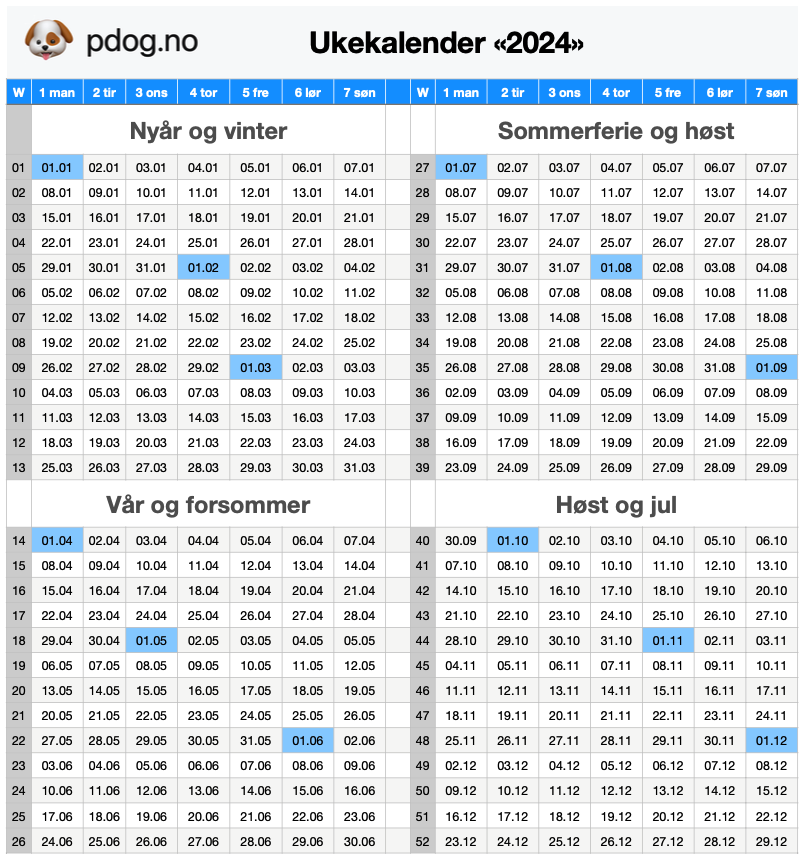

+++
title="Hva er en ukekalender og hvorfor bør jeg bruke det?"
linktitle = "Hva er en ukekalender?"
[menu]
main = { weight = 2, parent = "Tid, kalender og produktivitet" }
+++

<!-- markdownlint-disable MD033 -->

{}

Jeg foreslår at verden tar i bruk _ukedato_ i stedet for dato og måneder, for å angi datoer.
Her publiserer jeg min _ukekalender_, og argumenter for hvorfor dette er en god idé.

{}

{}

<a href="a4.pdf">A4-versjon av 2024 til utskrift</a> 
<a href="a3.pdf">A3-versjon av 2024 til utskrift</a> 
<a href="numbers.numbers">Fil i Numbers med oppbygging slik at du kan lage din egen kalender</a> 
<a href="kalenderfil.ics">.ics-fil med alle datoer fra 1994 til 2094</a> 
<a href="script.py">Python-skript for å lage dine egne .ics-filer</a>

{}

#### Slik oppgir du ukedato

I dagligtale kan du si "uke [tall]", og legge til hvilken ukedag du snakker om.

For skriftlig datonotering, kan du sette det sammen slik:

- årstallet på fire siffer, for eksempel <code>2023</code>
- ukenummeret med stor "W" for "week" som prefiks og deretter ukenummeret med ledende null, for
eksempel <code>W08</code>
- ukedagen oppgis som et tall uten ledende null, hvor uka starter på mandag, for eksempel
<code>2</code>

Datoen over blir <code>2023-W08-2</code> eller tirsdag i uke 8 i 2023. Datoen korresponderer til
<code>21. februar 2023</code>.

Bildet over eller til høyre viser 2023 sin ukekalender, med dag og måned som referanse.
De blå feltene er starten på nye måneder, for å gjøre det lett å navigere i kalenderen hvis du
snakker med noen som enda ikke har adoptert ukedatoer.

#### Fordeler med å bruke ukedato og ukekalender

- Alle uker starter og slutter på samme dag, og det er alltid like mange dager i hver uke. Det
kan man ikke si om måneder.
- Mange organiserer allerede livet sitt rundt uker, på jobben, barnehage og skole,
fritidsaktiviteter. Jeg jobber alltid dagene 1 til 5, jeg spiller tennis på dag 2 og jeg
gleder meg til helgen som er dag 6 og 7.
- I noen bransjer brukes uker allerede, for eksempel innen utdanning og regnskap.
- Å planlegge større prosjekter som skal gå over uker, blir lettere fordi man har et klart syn på
hvor lang tid man bruker.
- Å regne ut avstand i antall dager er lettere, fordi man ikke må ta stilling til de avvikende
antall dager i en måned.

#### Svar på argumenter mot bruken av ukedato

**Det er flere ting som skjer samme dato og måned hvert år, for eksempel 17. mai
eller 24. desember**  
Ja, men det er også flere ting som skjer samme ukedag hvert år, uavhengig av dato, slik som
fastelavn, overgang sommer- og vintertid, påske- og pinsedagene, advent- og juledagene.
Av litt mindre høytidelige hendelser, vil for eksempel festivaler som regel arrangeres på de
samme ukedagene, uavhengig av dato.

**Jeg har ikke et forhold til ukenummer, jeg kjenner dato og måneder!**  
Det er sant, men at man ikke _kan_ eller _kjenner til_ eller er _vant med_ noe, er aldri et godt
argument for å avvise noe. Vi må være villig til å prøve nye ting, konsepter og ideer, og ikke
avvise noe bare fordi vi umiddelbart ikke ser at vi kommer til å klare det.

**Det er vanskelig å orientere seg på hvor man er i året når det er 52/53 uker, det er lettere
med 12 måneder**  
Jeg er ikke enig, men jeg har delt inn året i fire "sesonger": "nyår og vinter", "vår og forsommer",
"sommerferie og høst" og "høst og jul". 4 er lettere å forholde seg til enn 12. Dessuten går det
perfekt opp, det er 13 uker i hver sesong, bortsett fra eventuelle år med 53 uker, da blir det
en ekstra uke på "høst og jul". Det er bedre å forholde seg til ett avvik, enn at årets tolv måneder
skal være avvikende hele tiden.

**Det er farlig å lage sin egen forståelse av tid og kalendre, det kan skje avvik du ikke har
tenkt på**  
Derfor har jeg heller ikke gjort det. Alt er basert på den gregorianske kalender, og mer konkret,
internasjonal standard <code>ISO 8601</code>, og i Norge er denne akseptert og innlemmet i
Norsk Standard som <code>NS-ISO 8601:2019</code>. Jeg bare bruker en del av denne standarden.
