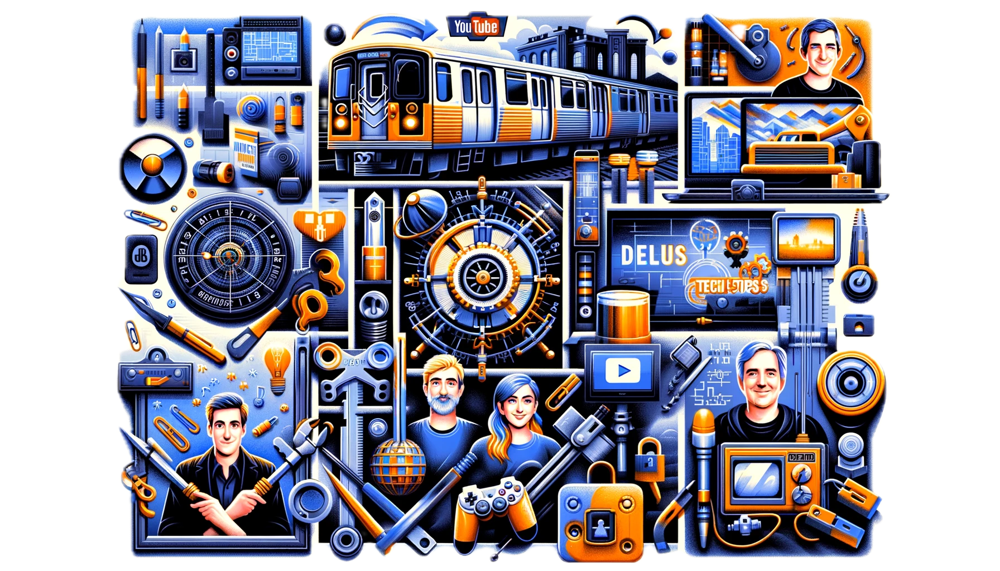

+++
title = "Mine YouTube-favoritter"
[menu]
main = { weight = 9, parent = "Petter" }
+++

<!-- markdownlint-disable MD033 -->

{}

Jeg har laget denne siden for å samle de YouTube-kanalene som jeg liker å følge med på, eller som
jeg en gang i tiden har likt å følge med på, men som ikke lengre legger ut nytt innhold. Formålet
er å kunne dele med andre som også ser på YouTube, og utveksle nye kanalideer med hverandre.

{}

  

    

      
    

  

 

Listen under kommer alfabetisk, da jeg synes det var vanskelig å finne en måte å kategorisere alt
på som ga mening, nok kanaler i hver kategori og ikke minst de kanalene som omtaler flere av dem
samtidig.

- [74 Gear ][74gear] – 747-pilot forklarer diverse temaer innen kommersiell luftfart.
- [Geoff Marshall ][GeoffMarshall] lager videoer om britisk tog- og
tunellbaneinfrastruktur
- [Linus Tech Tips ][LinusTechTips] har en god del interessante videoer, en del om
PC-bygging som jeg ikke bryr meg om.
- [DeviantOllam ][DeviantOllam] er en penetrasjonstester og profesjonell låsedirker som
forklarer en rekke teamer innenfor fysisk sikkerhet.
- [LockPickingLawyer ][LockPickingLawyer] viser hvordan man dirker opp forskjellige låser
av alle slag.
- [Friday Adventure Club ][FridayAdventureClub] har en del videoer om hans jobb som
sjåfør for Amazon-pakker.
- [DougDoug ][DougDoug] spiller forskjellige spill på direktestrømming, mens han lager
diverse utfordringer for seg selv eller publikum.
- Serien om hummeren Leon på kanalen til [Brandy Brandwood ][brandy] – en hummer som
egentlig skal selges, reddes av Brandy og gis et nytt liv i et akvarium hjemme hos han.
- En rekke av videoene til [Casey Neistat ][casey] som er full av energi, positivitet og
kreative ideer.
- [Defunctland ][Defunctland] har en rekke interesannte videoer om fornøyelsesparker
(speiselt Disney) og temaliknende opplevelser, samt barne-tv-serier.
- [Mark Rober ][MarkRober] er en tidligere NASA-ingenør og lager en rekke fysiske, syke
prosjekter. Spesielt vil jeg anbefale
[Backyard Squirrels Series ][BackyardSquirrelsSeries].
- [MegaLag ][Megalag] har en del videoer hvor han startet med å teste hvordan det er å
sende AirTag til forskjellige steder på jorden, og har endt opp med et fantastisk innblikk i den
utdaterte verdenen av logistikk.
- [Simone Giertz ][SimoneGiertz] svensk-amerikansk oppfinner som lager både morsomme og
interessante prosjekter.
- [Spaghetti Road ][SpaghettiRoad] er en morsom danske som ble kjent ved å spørre alle
ambassader i Danmark om å få et flagg fra landet deres, og det fikk han.
- [Technology Connections ][TechnologyConnections] er videoer av en svært allvitende
amerikaner som virkelig vet å finne de snodigste og obskure elektriske produktene som finnes, og
gjøre det interessant selv om man har ingen forkunnskaper eller interesse i temaet, ispedd en del
andre ting om elektronikk, strøm, lyd og bilde, lys, trafikk, med mer.

[74gear]: https://www.youtube.com/@74gear
[GeoffMarshall]: https://www.youtube.com/@geofftech2
[LinusTechTips]: https://www.youtube.com/@LinusTechTips
[DeviantOllam]: https://www.youtube.com/@DeviantOllam
[LockPickingLawyer]: https://www.youtube.com/@lockpickinglawyer
[FridayAdventureClub]: https://www.youtube.com/@FridayAdventureClub
[DougDoug]: https://www.youtube.com/@DougDoug
[brandy]: https://www.youtube.com/@Bradybrandwood
[casey]: https://www.youtube.com/@casey
[Defunctland]: https://www.youtube.com/@Defunctland
[MarkRober]: https://www.youtube.com/@MarkRober
[BackyardSquirrelsSeries]: https://www.youtube.com/playlist?list=PLgeXOVaJo_gl1ZIpbYyPRXzQner7-5j5k
[Megalag]: https://www.youtube.com/@MegaLag
[SimoneGiertz]: https://www.youtube.com/@simonegiertz
[SpaghettiRoad]: https://www.youtube.com/@SpaghettiRoad
[TechnologyConnections]: https://www.youtube.com/@TechnologyConnections
